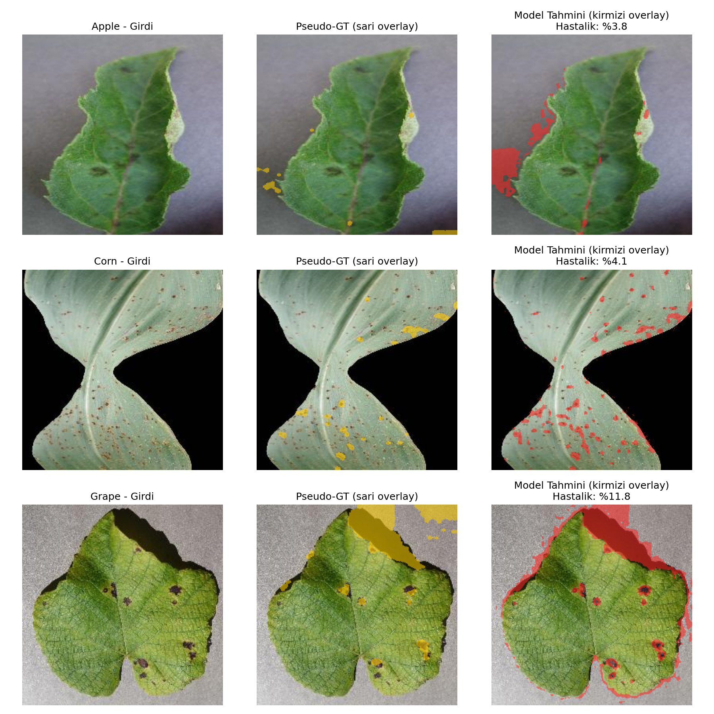

# Yaprak Analiz (Leaf Analysis)

Mobil Cihazlarda Gerçek Zamanlı Yaprak Hastalığı Segmentasyonu — Bitirme Projesi
Bandırma Onyedi Eylül Üniversitesi

**Hazırlayanlar:** Hazan Ezgi Erçin (2311504299) & Fatih Taşkın (2111504031)

## English Summary

An Android application for real-time plant leaf disease detection and
severity analysis, developed as a senior thesis project. Uses a U-Net
segmentation model together with a NIR (near-infrared) model, trained on
the PlantVillage dataset (apple, corn, grape leaves). The trained models
are converted to TensorFlow Lite for on-device mobile inference.

- `Android_Uygulama/` — Android app source code (Kotlin)
- `Python_Model/` — model training code (U-Net + NIR), TFLite conversion scripts
- `Raporlar/` — thesis and project reports, including an English report
  (`HazanEzgi_Ercin_Fatih_Taskin_Project_Report_EN.docx`)

The PlantVillage dataset itself is not included in this repo due to its size;
it is publicly available at
https://www.kaggle.com/datasets/arjuntejaswi/plant-village

---

## Örnek Sonuç

Model, RGB yaprak görüntüsü üzerinde hastalıklı bölgeleri segmente ediyor. Aşağıda üç kategoriden birer örnek: girdi görüntü, referans (pseudo-GT) maske ve model tahmini overlay olarak gösteriliyor.



## Değerlendirme Metrikleri (IoU / Dice)

PlantVillage veri setinde piksel seviyesinde elle etiketlenmiş segmentasyon maskesi bulunmadığından, eğitimde de kullanılan HSV renk-tabanlı heuristik (`maske_olustur.py`) ile pseudo-ground-truth maskeler üretilip model tahminiyle karşılaştırıldı (`metrik_hesapla.py`, `test_verileri/` üzerinde, n=24):

| Kategori | n | Mean IoU | Mean Dice |
|---|---|---|---|
| Corn | 8 | 0.602 | 0.739 |
| Apple | 8 | 0.370 | 0.518 |
| Grape | 8 | 0.305 | 0.444 |
| **Genel** | 24 | **0.426** | **0.567** |

**Gözlem:** Corn görüntülerinde arka plan zaten siyah/temiz olduğu için model belirgin şekilde daha iyi performans gösteriyor. Apple ve Grape görüntülerinde gri/dokulu arka plan ve gölgeler zaman zaman hastalıklı bölge olarak yanlış segmente ediliyor — bu, modelin bilinen bir sınırlaması ve ileride arka plan çıkarma (background removal) ön işleme adımıyla iyileştirilebilir.

## Proje Özeti

U-Net segmentasyon modeli ve NIR (yakın kızılötesi) modeli kullanılarak yaprak
hastalıklarının tespiti ve şiddet analizi yapan bir Android uygulaması.
PlantVillage veri seti (elma, mısır, üzüm) üzerinde eğitilmiştir.

## İçerik

| Klasör | Açıklama |
|---|---|
| `Android_Uygulama/` | Android uygulaması kaynak kodu (Kotlin/Java) |
| `Python_Model/` | Model eğitim kodu, U-Net + NIR modelleri, TFLite dönüşümleri |
| `Raporlar/` | Bitirme tezi ve proje raporları |
| `*.pptx` | Proje sunumu |

## Python Model Kodunu Çalıştırmak İçin

```
pip install tensorflow numpy opencv-python matplotlib
```

- `egitim.py` — Segmentasyon modeli eğitimi
- `egitim_nir.py` — NIR model eğitimi
- `final_test.py` — Model test ve görselleştirme
- `metrik_hesapla.py` — IoU ve Dice metrikleri

**Not:** PlantVillage veri seti bu repoya dahil edilmemiştir (boyut nedeniyle).
Veri setine buradan ulaşabilirsiniz:
https://www.kaggle.com/datasets/arjuntejaswi/plant-village

## Android Kaynak Kodunu Açmak İçin

1. Android Studio'yu aç
2. File → Open → `Android_Uygulama` klasörünü seç
3. Gradle sync bekle
4. Build → Build Bundle/APK → Build APK

## Teşekkür

Bu bitirme projesinin danışmanlığını üstlenen Dr. Öğr. Üyesi **Alpay Doruk**'a
(Bandırma Onyedi Eylül Üniversitesi, Bilgisayar Mühendisliği Bölümü)
değerli katkı ve rehberliği için teşekkür ederiz.
